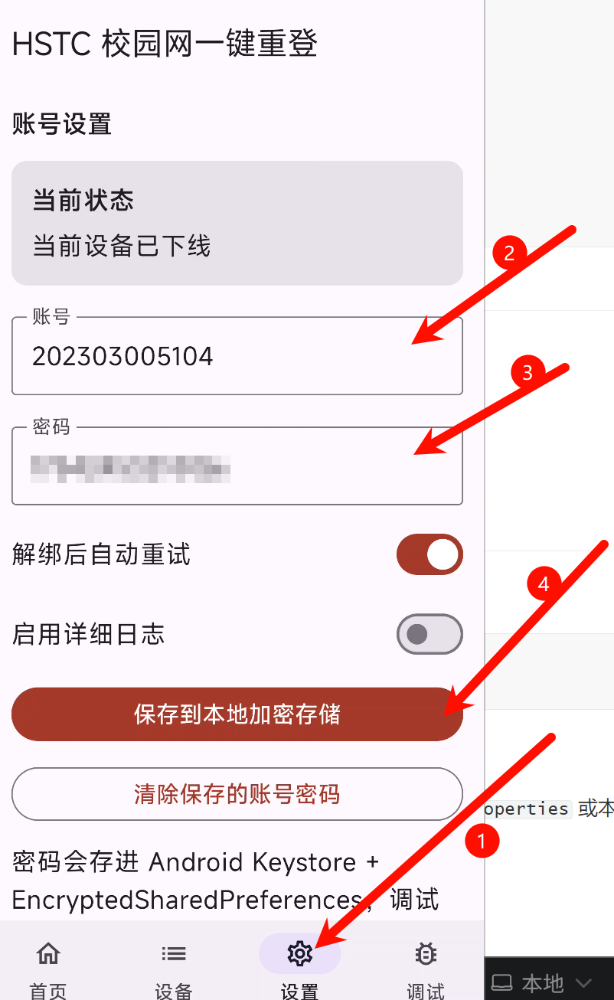
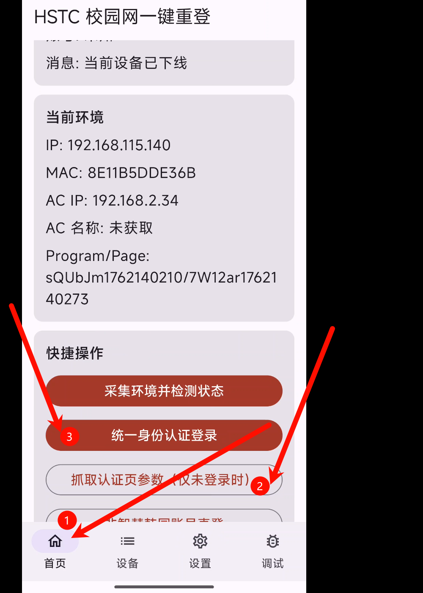

# HSTC Quick Login

韩山师范学院校园网 Android 登录工具，目标是把常见的校园网联网操作收敛到一个原生 App 里，减少反复打开认证页、设备满额后手动解绑、登录失败后重复尝试的成本。

## 项目简介

这个项目是一个基于 Kotlin 和 Jetpack Compose 的 Android 应用，围绕韩山师范学院校园网门户 `rz.hstc.edu.cn` 提供以下能力：

- 检测当前设备是否在线
- 采集当前网络环境参数（IP、MAC、AC IP 等）
- 普通账号密码直登
- 统一身份认证登录
- 加载账号绑定设备列表
- 解绑设备后自动重试登录
- 注销当前在线设备
- 记录调试日志与原始响应，方便排查问题

应用内目前包含四个页面：`首页`、`设备`、`设置`、`调试`。

## 使用流程建议

### 如何使用

1. 进入 `设置` 页面保存账号和密码
2. 确保当前设备处于未登录校园网状态，且连接着HSTC网络，并未开热点。
3. 回到 `首页` 点击 `抓取认证页参数（仅未登录时）`
4. 随后点击`统一身份认证登录` 
5. 认证完成后应用会自动刷新在线状态





## 技术栈

- Kotlin
- Jetpack Compose + Material 3
- Android ViewModel + Coroutine
- OkHttp
- Android Keystore + EncryptedSharedPreferences
- Gradle Kotlin DSL

## 功能说明

### 1. 状态检测

通过校园网接口检测当前设备在线状态，并展示当前在线账号、状态消息和最近一次操作结果。

### 2. 环境参数采集

登录校园网前通常需要拿到设备所在网络环境参数。项目会尝试自动采集：

- `IP`
- `IPv6`
- `MAC`
- `wlan_ac_ip`
- `wlan_ac_name`
- `program_index`
- `page_index`
- `jsVersion`

当自动采集不完整时，也支持在未登录状态下打开认证页，通过内置 WebView 抓取认证页跳转参数。

### 3. 两种登录方式

支持两条登录路径：

- `非智慧韩园账号直登`：调用门户接口直接登录
- `统一身份认证登录`：打开学校统一认证流程，并尝试自动点击入口、自动填充账号密码

如果某些账号不支持普通直登，应用会提示改走统一身份认证。

### 4. 设备管理

当门户提示设备数量达到上限、需要解绑或当前终端受限时，应用可以：

- 加载绑定设备列表
- 区分当前设备与其他已绑定设备
- 解绑指定设备
- 在开启 `解绑后自动重试` 时自动再次发起登录
- 注销当前在线设备

### 5. 凭据与日志

- 账号密码保存在 `Android Keystore + EncryptedSharedPreferences`
- 支持开启或关闭详细日志
- 调试页可查看最近日志和最后一次原始响应

## 项目结构

```text
HSTC/
├─ app/
│  ├─ src/main/java/com/hstc/quicklogin/
│  │  ├─ data/        # 校园网接口、凭据存储、环境采集、设备管理
│  │  ├─ di/          # 简单依赖注入容器
│  │  ├─ ui/          # Compose 页面与 ViewModel
│  │  ├─ MainActivity.kt
│  │  └─ HstcQuickLoginApp.kt
│  ├─ src/main/res/   # 资源文件与网络配置
│  └─ build.gradle.kts
├─ gradle/
├─ build.gradle.kts
├─ settings.gradle.kts
└─ README.md
```

## 运行要求

- Android Studio Ladybug 及以上，或兼容的 Android Studio 版本
- JDK 17
- Android SDK 35
- 最低支持 Android 8.0 (`minSdk 26`)

## 本地开发

### 1. 克隆项目

```powershell
git clone <your-repo-url>
cd HSTC
```

### 2. 使用 Android Studio 打开

推荐直接使用 Android Studio 打开项目。首次打开后，IDE 会根据 `local.properties` 或本机配置识别 Android SDK。

### 3. 命令行构建

Windows 下可执行：

```powershell
.\gradlew.bat assembleDebug
```

如果你在 macOS 或 Linux：

```bash
./gradlew assembleDebug
```

调试 APK 默认输出位置：

```text
app/build/outputs/apk/debug/app-debug.apk
```


## 注意事项

- 该项目目前针对韩山师范学院校园网门户实现，接口和参数具有明显校内环境耦合，不保证适用于其他学校
- 某些登录流程依赖当前设备处于校园网认证环境中，离开该环境时无法正常获取参数
- `AndroidManifest.xml` 中启用了明文流量与自定义网络配置，属于为校园网认证流程兼容而做的工程处理，后续可以再做更细化的收敛
- 仓库中如存在抓包文件、窗口 dump、构建产物等内容，不建议提交到 Git

## 测试

当前仓库包含单元测试：

- `JsonpParserTest`

可通过以下命令运行测试：

```powershell
.\gradlew.bat testDebugUnitTest
```
