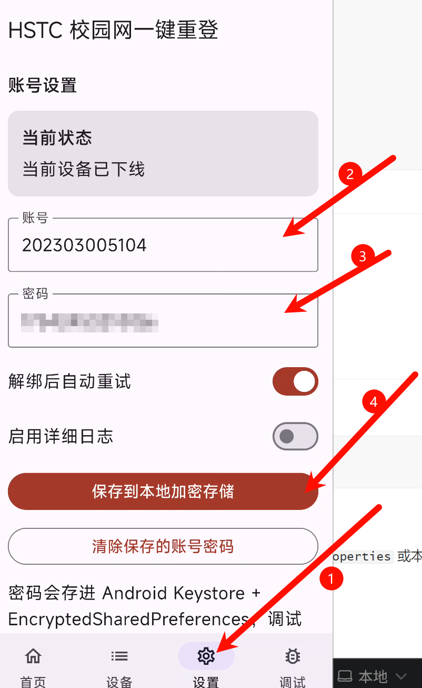
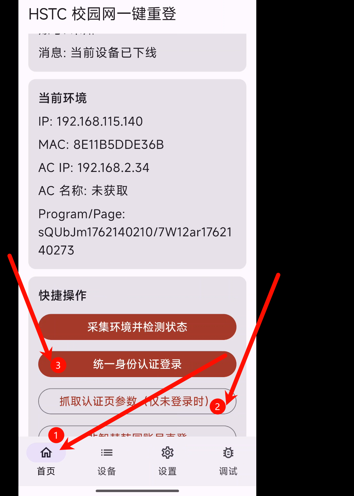

# HSTC 校园网一键重登

韩山师范学院校园网 Android 登录工具，目标是把常见的校园网联网操作收敛到一个原生 App 里，减少反复打开认证页、跨区域重新登录、设备满额后手动解绑、登录失败后重复尝试的成本。

## 项目简介

这个项目是一个基于 Kotlin 和 Jetpack Compose 的 Android 应用，围绕韩山师范学院校园网门户 `rz.hstc.edu.cn` 提供以下能力：

- 检测当前设备是否在线
- 采集当前网络环境参数（IP、MAC、AC IP 等）
- 模拟系统 WLAN 认证页探测，自动发现不同区域的认证入口
- 从门户 URL、HTML/JavaScript 跳转、CAS 回调 `state` 中提取认证参数
- 普通账号密码直登
- 统一身份认证登录
- 加载账号绑定设备列表
- 解绑设备后自动重试登录
- 注销当前在线设备
- 记录调试日志与原始响应，方便排查问题

应用内目前包含四个页面：`首页`、`设备`、`设置`、`调试`。

## 使用流程建议

### 如何使用

1. 进入 `设置` 页面保存账号和密码
2. 确保手机已连接 `HS_WIFI`，并且没有开启热点或代理类工具
3. 如果当前已在线，先在系统认证页或应用内注销后再测试参数抓取
4. 回到 `首页` 点击 `抓取认证页参数（仅未登录时）`
5. 应用会在内置 WebView 中模拟系统联网探测，必要时自动进入 `统一身份认证` 并提交已保存的账号密码
6. 抓到参数后，点击 `统一身份认证登录` 或按当前状态继续快速登录
7. 认证完成后应用会自动刷新在线状态





### 跨区域测试建议

在宿舍、教学区、食堂等不同区域测试时，推荐按下面顺序排查：

1. 连接 `HS_WIFI`
2. 确认系统会提示 `登录到 WLAN 网络 HS_WIFI`
3. 不要先点系统通知，先打开本应用点击 `抓取认证页参数（仅未登录时）`
4. 如果提示未抓到参数，打开 PCAPdroid 后再点一次本应用的抓取按钮
5. 将 `/storage/emulated/0/Download/PCAPdroid/` 下新生成的 pcap 文件用于分析

PCAPdroid 对本应用内置 WebView 的流量通常足够；如果需要查看系统 WLAN 登录页或 HTTPS 表单明文，再考虑使用 Reqable、HTTP Toolkit 等带证书解密的抓包工具。

## 技术栈

- Kotlin
- Jetpack Compose + Material 3
- Android ViewModel + Coroutine
- OkHttp
- Android Keystore + EncryptedSharedPreferences
- Gradle Kotlin DSL

## 功能说明

### 1. 状态检测

通过校园网接口检测当前设备在线状态，并展示当前在线账号、状态消息和最近一次操作结果。

### 2. 环境参数采集

登录校园网前通常需要拿到设备所在网络环境参数。项目会尝试自动采集：

- `IP`
- `IPv6`
- `MAC`
- `wlan_ac_ip`
- `wlan_ac_name`
- `program_index`
- `page_index`
- `jsVersion`

当自动采集不完整时，也支持在未登录状态下打开认证页，通过内置 WebView 抓取认证页参数。新版抓取逻辑不依赖固定网关 IP，会按以下路径依次尝试：

- 访问多个 HTTP 联网探测地址，等待校园网劫持
- 解析 `rz.hstc.edu.cn` 或 `192.168.x.x` 这类门户 URL 中的 `wlanuserip`、`usermac`、`wlanacip` 等参数
- 读取当前页面 HTML/JavaScript，解析脚本跳转里的认证参数
- 自动点击门户页的 `统一身份认证`
- 自动填写已保存账号密码并提交 CAS 登录表单
- 从 CAS 回调 URL 或 `state` 中恢复认证参数

### 3. 两种登录方式

支持两条登录路径：

- `非智慧韩园账号直登`：调用门户接口直接登录
- `统一身份认证登录`：打开学校统一认证流程，并尝试自动点击入口、自动填充账号密码

如果某些账号不支持普通直登，应用会提示改走统一身份认证。

### 4. 设备管理

当门户提示设备数量达到上限、需要解绑或当前终端受限时，应用可以：

- 加载绑定设备列表
- 区分当前设备与其他已绑定设备
- 解绑指定设备
- 在开启 `解绑后自动重试` 时自动再次发起登录
- 注销当前在线设备

### 5. 凭据与日志

- 账号密码保存在 `Android Keystore + EncryptedSharedPreferences`
- 支持开启或关闭详细日志
- 调试页可查看最近日志和最后一次原始响应

## 项目结构

```text
HSTC/
├─ app/
│  ├─ src/main/java/com/hstc/quicklogin/
│  │  ├─ data/        # 校园网接口、凭据存储、环境采集、设备管理
│  │  ├─ di/          # 简单依赖注入容器
│  │  ├─ ui/          # Compose 页面与 ViewModel
│  │  ├─ MainActivity.kt
│  │  └─ HstcQuickLoginApp.kt
│  ├─ src/main/res/   # 资源文件与网络配置
│  └─ build.gradle.kts
├─ gradle/
├─ build.gradle.kts
├─ settings.gradle.kts
└─ README.md
```

## 运行要求

- Android Studio Ladybug 及以上，或兼容的 Android Studio 版本
- JDK 17
- Android SDK 35
- 最低支持 Android 8.0 (`minSdk 26`)

## 本地开发

### 1. 克隆项目

```powershell
git clone https://github.com/sujingyan12138/hstc-campus-login.git
cd HSTC
```

### 2. 使用 Android Studio 打开

推荐直接使用 Android Studio 打开项目。首次打开后，IDE 会根据 `local.properties` 或本机配置识别 Android SDK。

### 3. 命令行构建

Windows 下可执行：

```powershell
$env:SystemRoot='C:\WINDOWS'
$env:WINDIR='C:\WINDOWS'
.\gradlew.bat assembleDebug
```

如果你在 macOS 或 Linux：

```bash
./gradlew assembleDebug
```

调试 APK 默认输出位置：

```text
app/build/outputs/apk/debug/app-debug.apk
```

当前包名：

```text
com.hstc.quicklogin
```

当前调试版本：

```text
versionName 1.0.1
versionCode 2
```

### 4. 安装到已连接手机

```powershell
adb install -r -d .\app\build\outputs\apk\debug\app-debug.apk
```

## 注意事项

- 该项目目前针对韩山师范学院校园网门户实现，接口和参数具有明显校内环境耦合，不保证适用于其他学校
- 某些登录流程依赖当前设备处于校园网认证环境中，离开该环境时无法正常获取参数
- 不要把账号密码、可解密 HTTPS 抓包、包含个人认证票据的 pcap 文件提交到 Git
- `AndroidManifest.xml` 中启用了明文流量与自定义网络配置，属于为校园网认证流程兼容而做的工程处理，后续可以再做更细化的收敛
- 仓库中如存在抓包文件、窗口 dump、构建产物等内容，不建议提交到 Git

## 测试

当前仓库包含单元测试：

- `JsonpParserTest`

可通过以下命令运行测试：

```powershell
$env:SystemRoot='C:\WINDOWS'
$env:WINDIR='C:\WINDOWS'
.\gradlew.bat testDebugUnitTest
```

也可以同时运行测试并生成调试 APK：

```powershell
$env:SystemRoot='C:\WINDOWS'
$env:WINDIR='C:\WINDOWS'
cmd /c gradlew.bat testDebugUnitTest assembleDebug
```
